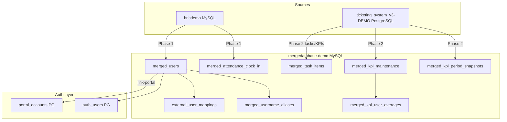

# Mergedatabase Consolidation Runbook

Consolidate **hrisdemo** + **ticketing_system_v3-DEMO** into **mergedatabase-demo** as the unified store for users, credentials, attendance, tasks, and KPI progress.

**Tickets stay in primary PostgreSQL** (`ticketing_system_v3-DEMO`).

## Architecture



## Target schema (mergedatabase)

| Table | Purpose |
|-------|---------|
| `merged_users` | **Credential SoT** — `source_user_id` = HRIS `users.id`, username/email/password_hash |
| `merged_attendance_clock_in` | Clock-in events linked to `source_user_id` |
| `external_user_mappings` | `hrisdemo.user_id` → `merged_users.source_user_id` (+ legacy username/email) |
| `merged_username_aliases` | Login with old HRIS username → merged user |
| `merged_task_items` / `merged_task_activities` | Task board mirror with `assigned_merged_source_user_id` |
| `merged_kpi_maintenance` / `merged_kpi_period_snapshots` | KPI definitions + period progress |
| `merged_kpi_user_averages` | **Overall average KPI % per employee** |

Prisma models: `prisma/db-secondary/schema.prisma`

## Phase 1: HRIS users + attendance

Migrates from `hrisdemo`:
- Users: `id` → `source_user_id`, `name`, `company_name`, plus auth (`username`, `email`, `password_hash`)
- Attendance: `attendance_logs` clock-in rows

```bash
# 1. Backup
mysqldump -u root hrisdemo > backup-hris.sql
mysqldump -u root mergedatabase-demo > backup-merged.sql

# 2. Dry run
npx tsx scripts/migrate-phase1-hris-to-merged.ts

# 3. Apply + link portal/auth
npx tsx scripts/migrate-phase1-hris-to-merged.ts --apply --link-portal

# Incremental (ongoing): watermark-based
npm run db:merge:hris-incremental
```

### Login (old + new username)

```sql
-- Direct merged_users lookup
SELECT source_user_id, username, name, company_name
FROM merged_users WHERE LOWER(username) = LOWER('old_hris_user');

-- Via alias
SELECT u.*
FROM merged_username_aliases a
JOIN merged_users u ON u.source_user_id = a.source_user_id
WHERE LOWER(a.username) = LOWER('old_hris_user');
```

Application: `findMergedUserByLogin()` in `src/lib/auth/merged-credentials.ts` checks username, email, employee_code, and `merged_username_aliases`.

## Phase 2: Tasks + KPI monitoring

Source: `kpi_maintenance`, `kpi_maintenance_period_snapshots`, `task_items`, `task_activities` (PostgreSQL).

```bash
# Dry run
npx tsx scripts/migrate-phase2-tasks-kpi-to-merged.ts

# Apply
npx tsx scripts/migrate-phase2-tasks-kpi-to-merged.ts --apply
# or
npm run db:sync:tasks-kpi
```

Computes `merged_kpi_user_averages` (weighted `overall_percent` + unweighted `average_percent` per employee).

## Full consolidation (both phases)

```bash
npx tsx scripts/migrate-consolidate-mergedatabase.ts              # dry-run
npx tsx scripts/migrate-consolidate-mergedatabase.ts --apply --link-portal
npx tsx scripts/migrate-consolidate-mergedatabase.ts --apply --phase1-only
npx tsx scripts/migrate-consolidate-mergedatabase.ts --apply --phase2-only
```

## Verification queries

```sql
-- Phase 1 counts
SELECT source_database, COUNT(*) FROM merged_users GROUP BY source_database;
SELECT source_database, COUNT(*) FROM merged_attendance_clock_in GROUP BY source_database;
SELECT COUNT(*) FROM external_user_mappings;
SELECT COUNT(*) FROM merged_username_aliases;

-- Users without password (cannot login via merged)
SELECT source_user_id, name, username, email
FROM merged_users
WHERE is_active = 1 AND (password_hash IS NULL OR password_hash = '');

-- Duplicate emails in merged_users
SELECT LOWER(email) AS email, COUNT(*) AS c
FROM merged_users WHERE email IS NOT NULL
GROUP BY LOWER(email) HAVING c > 1;

-- Phase 2 counts
SELECT COUNT(*) FROM merged_kpi_maintenance;
SELECT COUNT(*) FROM merged_kpi_period_snapshots;
SELECT COUNT(*) FROM merged_task_items;
SELECT COUNT(*) FROM merged_kpi_user_averages;

-- Per-employee KPI average (leaderboard)
SELECT display_name, company_name, kpi_count, overall_percent, average_percent
FROM merged_kpi_user_averages a
LEFT JOIN merged_users u ON u.source_user_id = a.source_user_id
ORDER BY overall_percent DESC
LIMIT 20;

-- Mapping coverage: HRIS users with portal link
SELECT COUNT(*) FROM external_user_mappings WHERE portal_account_id IS NOT NULL;
```

## Environment

```env
HRIS_MERGE_SOURCE_DB=hrisdemo
HRIS_MERGE_TARGET_DB=mergedatabase-demo
HRIS_MERGE_SOURCE_TAG=hrisdemo
DATABASE_URL_SECONDARY_SYNC=mysql://root@localhost:3306/mergedatabase-demo
TICKETING_MERGE_SOURCE_TAG=ticketing_system
```

## Credential priority

| `MERGED_CREDENTIALS_SOURCE` | Login order |
|-----------------------------|-------------|
| unset / `portal` | `portal_accounts` first, then `merged_users` fallback |
| `merged` | `merged_users` first (with aliases), then portal |

Set `MERGED_CREDENTIALS_SOURCE=merged` when mergedatabase is the credential SoT.

## Post-migration

1. `npm run db:generate:secondary` (stop app server first on Windows if EPERM)
2. `npx tsx scripts/check-population-duplicates.ts`
3. `npx tsx scripts/smoketest-portal-work-transfer.ts` (if portal work was transferred)
4. Schedule: `npm run db:merge:hris-incremental` + `npm run db:sync:tasks-kpi`

## Safety

- All CLI scripts default to **dry-run**; pass `--apply` to write
- Upserts use `ON DUPLICATE KEY UPDATE` (idempotent)
- Batching: 500 rows per insert batch
- Per-row conflict collection in Phase 1 mappings
- **Backup before `--apply` on production**
