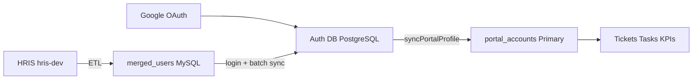

# Multi-Database Auth Architecture

This document describes how **Auth DB**, **Primary DB**, and **Secondary (Merged) DB** divide responsibility, how users are matched, and how to migrate existing data.

## Database roles

| Database | Engine | Purpose |
|----------|--------|---------|
| **Auth DB** (`DATABASE_URL_AUTH`) | PostgreSQL | **Source of truth** for identity: OAuth accounts, HRIS linkage, portal role, company membership, configurable role mappings |
| **Primary DB** (`DATABASE_URL_PRIMARY`) | PostgreSQL | **Operational** ticketing/KPI/tasks; `portal_accounts` is a **synced profile cache** keyed by `authUserId` |
| **Secondary DB** (`DATABASE_URL_SECONDARY`) | MySQL | **HRIS read model** (`merged_users`, attendance, reporting ETL). Credentials login validates here; profile syncs outward |



## Schema summary

### Auth DB (`prisma/db-auth/schema.prisma`)

- `auth_users` — canonical user (`email`, `username`, `hrisSourceUserId`, `portalRole`, `headPrivileges`, `companyId`)
- `auth_accounts` — OAuth provider links (NextAuth compatible)
- `auth_companies` — org/company names from HRIS
- `auth_role_mappings` — configurable HRIS role → portal role (+ head flag)

### Primary DB (`prisma/db-primary/schema.prisma`)

- `portal_accounts` — synced operational profile
  - `authUserId` — logical FK to Auth DB (no cross-DB constraint)
  - `mergedSourceUserId` — logical FK to `merged_users.source_user_id`
  - `passwordHash`, `oauthProvider`, `oauthSubject` — **deprecated**, kept for migration only
  - `profileSyncedAt` — last successful sync timestamp

Ticket tables continue referencing agents/emails; enrichment uses synced `portal_accounts`.

## Sync entry point

All identity flows converge on:

```ts
import { syncPortalProfile } from "@/lib/auth/sync-portal-profile";

await syncPortalProfile(canonicalProfile, "oauth" | "hris" | "migration");
```

### Triggers

| Event | Handler |
|-------|---------|
| Google OAuth sign-in | `syncOAuthUser` → `syncPortalProfile(..., "oauth")` |
| Username/password sign-in (HRIS) | `ensurePortalFromMergedUser` → `syncPortalProfile(..., "hris")` |
| Scheduled HRIS refresh | `npm run db:sync:hris-portal` |
| One-time migration | `npm run db:migrate:portal-to-auth` |

### Conflict policy

- **Name, username, image**: refreshed from canonical source on each sync
- **Role**: upgrades only (`Customer` → staff); never auto-downgrades `SuperAdmin`
- **headPrivileges**: set when mapping requires; never cleared automatically
- **Company assignment**: sets `staffDesignatedCompanyId` when empty and HRIS company matches roster

## Role mapping

Default mappings (seeded via `npm run db:seed:auth-role-mappings`):

| HRIS role | Portal role | headPrivileges |
|-----------|-------------|----------------|
| `super_admin` | SuperAdmin | false |
| `admin` | Admin | true |
| `employee` | Personnel | false |

Head titles in `position`/`department` (e.g. "IT Support Head") elevate `employee` → **Admin + headPrivileges**.

Override per HRIS role in `auth_role_mappings` without code changes.

Code: `src/lib/auth/role-mapping.ts`

Permission helpers: `src/lib/auth/portal-permissions.ts`

## Step-by-step migration

### 1. Create Auth database

```sql
CREATE DATABASE ticketing_auth_dev;
```

Set `DATABASE_URL_AUTH` in `.env` (see `.env.example`).

### 2. Apply schemas

```bash
npm run db:push:all
npm run db:generate:all
```

### 3. Seed role mappings

```bash
npm run db:seed:auth-role-mappings
```

### 4. Backfill existing portal users → Auth DB

```bash
npm run db:migrate:portal-to-auth
```

Matches by email to `merged_users` when possible; otherwise migrates OAuth/local portal rows.

### 5. Batch sync all HRIS users

```bash
npm run db:sync:hris-portal
```

Run on a schedule (e.g. hourly cron) to propagate HRIS profile/role changes.

### 6. Verify sign-in paths

- **Credentials**: HRIS username/email + password → merged DB verify → sync → JWT
- **Google OAuth**: Google profile → Auth DB → sync → JWT

### 7. Deprecation (future)

Once all accounts have `authUserId` and OAuth/credentials flow through Auth DB:

1. Stop writing `passwordHash` on `portal_accounts`
2. Drop `oauthProvider` / `oauthSubject` from Primary after Auth DB accounts are complete
3. Move password hashes to Auth DB if local passwords are retained alongside OAuth

## Operational notes

- **No cross-DB FKs**: references are logical (`authUserId`, `mergedSourceUserId`). Sync layer maintains consistency.
- **MySQL case sensitivity**: merged login uses raw SQL with `LOWER()` (Prisma `mode: insensitive` unsupported on MySQL).
- **Agent rows**: staff sync calls `ensureAgentRowForPortalStaff` when a designated company is set.
- **Errors**: batch sync logs per-user failures and continues; login sync throws to block invalid sessions.

## Key files

| File | Role |
|------|------|
| `src/lib/auth/sync-portal-profile.ts` | Unified sync service |
| `src/lib/auth/role-mapping.ts` | HRIS → portal role logic |
| `src/lib/auth/sync-oauth-user.ts` | OAuth adapter |
| `src/lib/auth/ensure-portal-from-merged.ts` | HRIS credentials adapter |
| `src/lib/auth/portal-permissions.ts` | Permission check examples |
| `scripts/sync-hris-portal-profiles.ts` | Scheduled batch sync |
| `scripts/migrate-portal-to-auth-db.ts` | One-time backfill |
