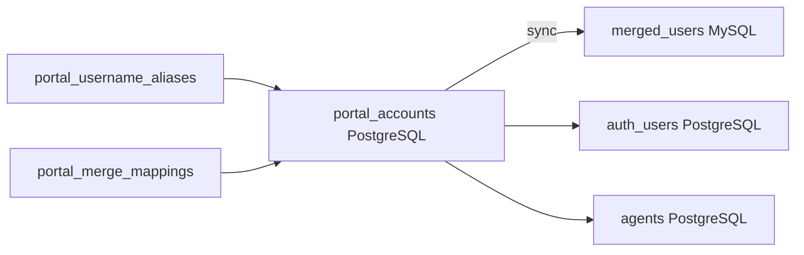

# PortalAccount Credential Sync

PortalAccount (`portal_accounts`) is the **source of truth for ticketing credentials** when `PORTAL_CREDENTIALS_SOURCE=portal`.

## Architecture



| Store | Role |
|-------|------|
| `portal_accounts.password_hash` | Login password (bcrypt) |
| `portal_username_aliases` | Legacy usernames → portal account |
| `portal_merge_mappings` | `portal_account_id` ↔ `merged_source_user_id` |
| `merged_users` | Denormalized copy for reporting / HRIS bridge |
| `merged_kpi_*` / `merged_task_*` | Task/KPI progress mirror (MySQL) |
| `merged_kpi_user_averages` | Overall average KPI progress per employee (MySQL) |
| `agents` / `tickets` | **Primary PostgreSQL only** — assignments stay in ticketing DB |

## Login (old + new username)

```sql
-- Resolve portal by email, username, or alias
SELECT pa.*
FROM portal_accounts pa
WHERE pa.account_status <> 'LEGACY_CONFLICT'
  AND (
    LOWER(pa.email) = LOWER($1)
    OR LOWER(pa.username) = LOWER($1)
    OR pa.id IN (
      SELECT portal_account_id FROM portal_username_aliases
      WHERE LOWER(username) = LOWER($1)
    )
  )
LIMIT 1;
```

Application code: `findPortalAccountByLogin()` in `src/lib/auth/portal-credentials.ts`.

Auth order in `src/lib/auth.ts`:

1. PortalAccount + `password_hash` (including aliases)
2. `merged_users` fallback when portal has no password (OAuth-only rows)

## Role mapping (portal → merged)

| Portal role | merged_users.role |
|-------------|-------------------|
| SuperAdmin | `super_admin` |
| Admin | `admin` |
| Personnel / Customer | `employee` |

Code: `mapPortalRoleToMergedHrisRole()` in `src/lib/auth/portal-to-merged-role.ts`.

Ticketing KPI head/leader titles still use `mapHrisToPortalRole()` when syncing **from** HRIS position fields.

## One-time / batch sync

```bash
# 1. Backup databases first
pg_dump ... > backup-primary.sql
mysqldump ... > backup-merged.sql

# 2. Apply migration (mapping tables)
npm run db:migrate:deploy:primary

# 3. Dry run
npx tsx scripts/sync-portal-to-merged-users.ts

# 4. Apply
npx tsx scripts/sync-portal-to-merged-users.ts --apply

# 5. Carry over ticket/KPI agent ownership from legacy portals
npx tsx scripts/transfer-portal-work-to-hris-users.ts --apply

# 6. Refresh MySQL mirror (tasks + KPIs with portal linkage; tickets stay in primary PG)
npm run db:sync:tasks-kpi

# 7. Smoke test
npx tsx scripts/smoketest-portal-work-transfer.ts
```

## Portal work in mergedatabase-demo

**Tickets remain in primary PostgreSQL only.** Only task and KPI progress is mirrored to MySQL, with `assigned_merged_source_user_id` linking back to `merged_users`:

```sql
-- KPIs assigned to an HRIS user
SELECT k.*
FROM merged_kpi_maintenance k
WHERE k.assigned_merged_source_user_id = ?
  AND k.source_database = 'ticketing_system';

-- Tasks assigned to an HRIS user
SELECT t.*
FROM merged_task_items t
WHERE t.assigned_merged_source_user_id = ?
  AND t.source_database = 'ticketing_system';

-- Overall average KPI progress per employee
SELECT display_name, kpi_count, snapshot_count,
       total_items, done_items,
       overall_percent,   -- weighted: done / total
       average_percent    -- unweighted mean of per-snapshot %
FROM merged_kpi_user_averages
WHERE source_database = 'ticketing_system'
ORDER BY overall_percent DESC;
```

Command: `npm run db:sync:tasks-kpi` (alias: `db:sync:portal-work`)

## Ongoing sync (cron / internal job)

```http
POST /api/jobs/sync-portal-merged
x-internal-job-key: <INTERNAL_JOB_KEY>
```

## Environment

```env
PORTAL_CREDENTIALS_SOURCE=portal
PORTAL_MERGE_SOURCE_TAG=portal_ticketing
HRIS_MERGE_SOURCE_TAG=hrisdemo
INTERNAL_JOB_KEY=your-secret
```

When `PORTAL_CREDENTIALS_SOURCE=portal`, `db:reconcile:merged-users` **does not** clear `portal_accounts.password_hash`.

## ID mapping

- HRIS-linked users: `portal_accounts.merged_source_user_id` = `merged_users.source_user_id` (from HRIS)
- Portal-only users: synthetic IDs ≥ `9000000000000` in `portal_merge_mappings`
- Progress (KPIs, tasks) references **agent IDs** in primary PG — use `transfer-portal-work-to-hris-users.ts` to merge duplicate agents. **Tickets stay in primary only.**

## Safety

- Default **dry-run** on CLI scripts
- Per-row error collection (batch continues on failure)
- Passwords only stored as bcrypt hashes; never logged
- Use transactions for single-portal updates where Prisma allows cross-DB operations are avoided (PG + MySQL are separate)
