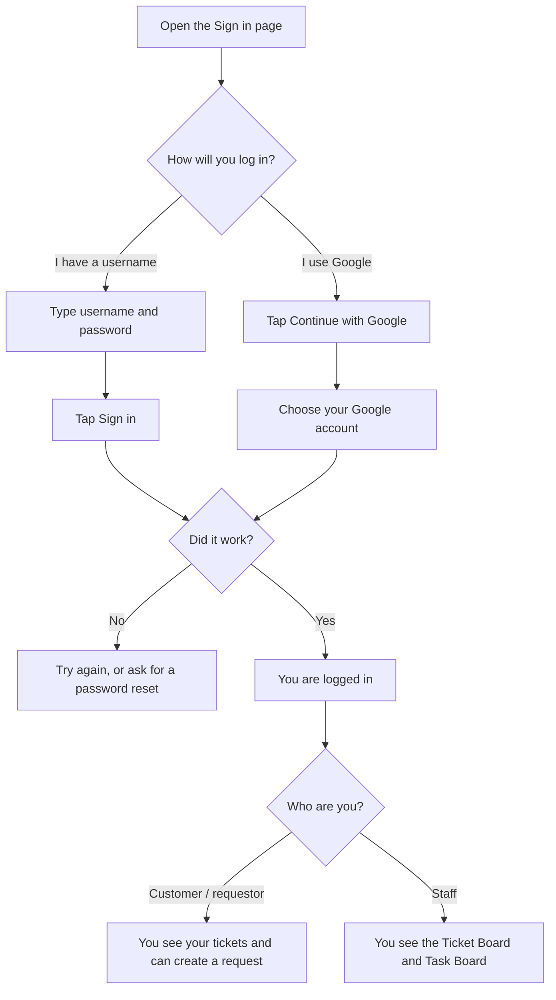
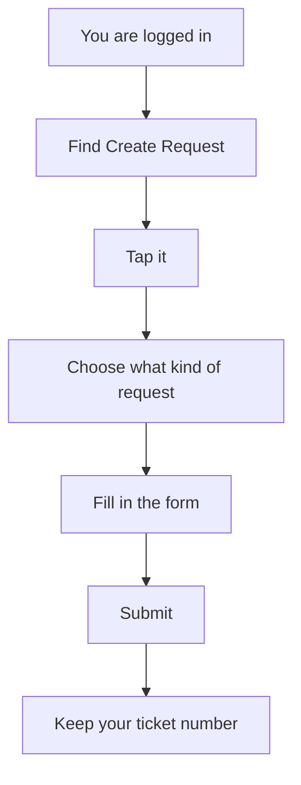
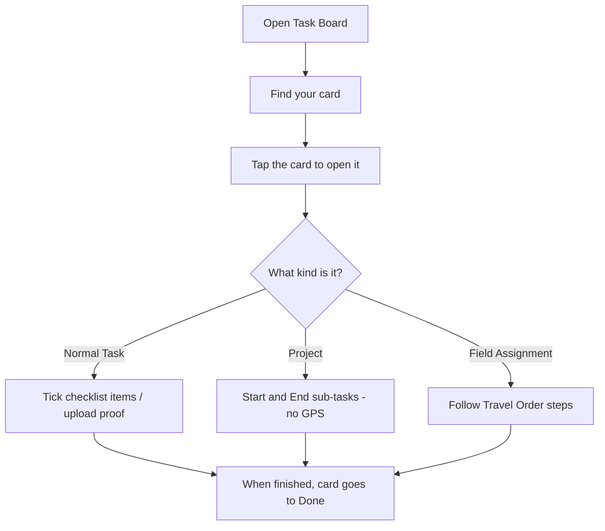
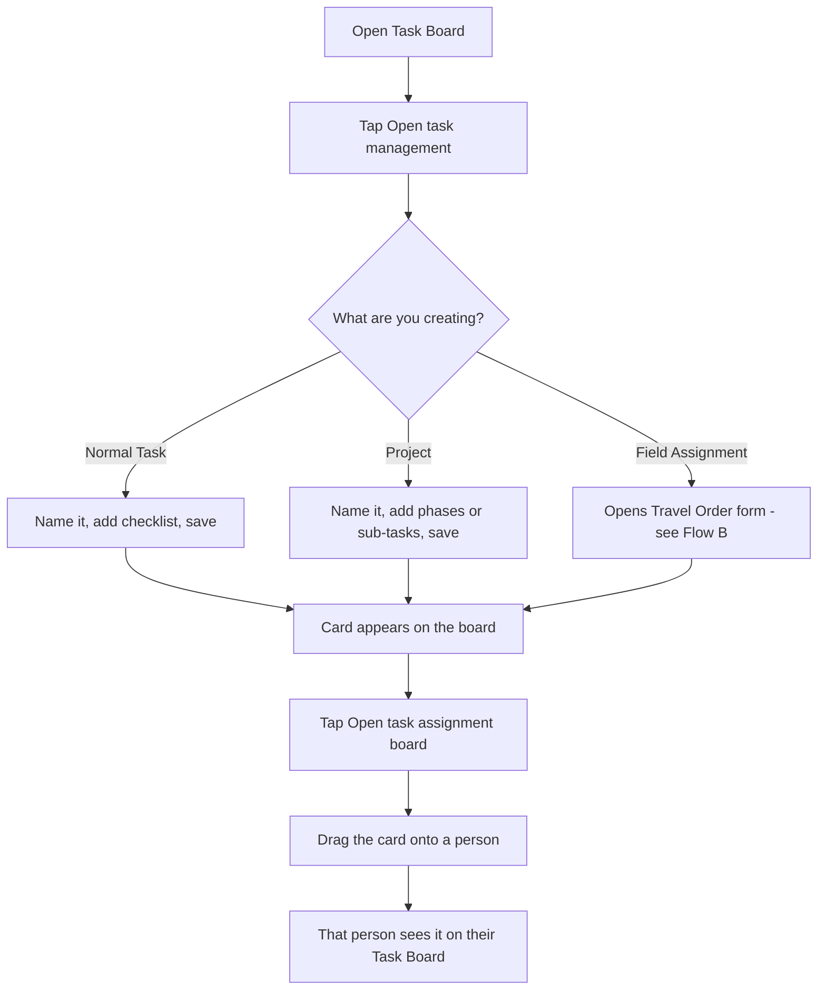
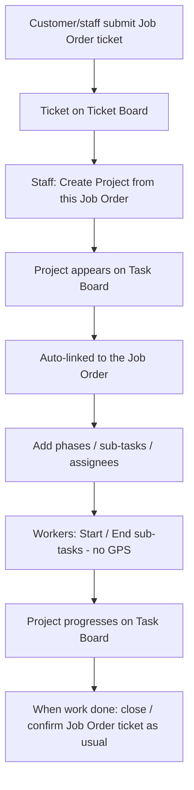

# Request Type Instruction Manual

**AGCTek Help Desk** — plain-language guide for choosing and submitting the right request.

---

## How to log in (simple steps)

### What this is
Logging in is how you open the Help Desk so you can create requests, check tickets, or do staff work.

### Where to start
1. Open the Help Desk website.
2. Go to the **Sign in** page.

### Two easy ways to get in

**Option A — Username and password** (most common for employees)
1. Type your **work username** (the same one you use for company systems / employee directory).
2. Type your **password**.
3. Tap **Sign in**.
4. You’re in.

Tip: Press and hold the eye icon next to the password if you want to check what you typed.

**Option B — Google**
1. Tap **Continue with Google** (if you see that button).
2. Pick your work Google account.
3. Say yes if Google asks permission.
4. You’re in.

Important: Use the **same email** that belongs to your Help Desk account. A different Google email will not work.

### Picture of the login flow (plain English)



### If you forgot your password
1. On the Sign in page, tap **Forgot password? Request reset**.
2. Type your username or email.
3. Send the request.
4. Wait for an admin to approve and reset it.
5. When they tell you it’s done, log in with the new password.

If you only ever log in with Google and never had a password, ask an admin for help instead of using “Forgot password.”

### If something goes wrong
| Problem | What to do |
|---------|------------|
| “Wrong username or password” | Check spelling and caps lock. Try again. If still stuck, request a password reset. |
| Google won’t let you in | Make sure it’s the email tied to your Help Desk account, or use username + password. |
| You’re in, but can’t create a new Issue/Concern | You probably still have an older Issue/Concern open or waiting for your confirmation. Finish that one first. You can still submit other request types. |

### When you’re done using the system
Tap **Sign out** from the menu or My Account so the next person can’t use your session.

After you log in, go to **Where do I create a request?** below.

---

## Where do I create a request?

### In one sentence
Tap **Create Request** (or **+ Create Request**). That is the button that starts a new help request.

### Easy places to find it
You do **not** need all of these — any one is enough:

1. On your **home screen**, look for a big **+ Create Request** button and tap it.
2. Open the **side menu** (on a phone, tap the ☰ menu), then tap **Create Request**.
3. At the **top of the page**, look for **Create Request** and tap it.
4. On your **ticket list** (Active Tickets / My Requests), tap Create Request if you see it there.

### What happens when you tap it
1. A page opens with the kinds of requests you can make.
2. Choose one (for example: problem ticket, payment, supplies, fund transfer, or job order).
3. Fill in the blanks.
4. Tap submit.
5. Write down or save your **ticket number** so you can find it later.

### Simple picture



### If you cannot find the button
- On a phone: open the **menu** first — Create Request is often inside the menu.
- Scroll up or down on the home page — the button is usually near the top.
- Ask a teammate or admin to point to **Create Request** on your screen.

### If the button will not let you make an Issue/Concern
You may still have an older problem ticket open or waiting for you to confirm it is fixed. Finish that one first.  
You can usually still create **other** kinds of requests (payment, supplies, fund transfer, job order).

### Note for staff
**Create Request** is for the five ticket types above.  
Travel Orders and Projects linked from a Job Order are started from the **Task Board** (explained later in this guide).

---

## How to start any request

1. Log in to the Help Desk (see **How to log in** above).
2. Tap **Create Request** (see **Where do I create a request?** above).
3. Pick the kind of request you need.
4. Fill in the form. Add screenshots if they help (optional).
5. Submit, then keep your **ticket number**.
6. Check progress under **Active Tickets** / **My Requests**.

**When the work is finished**, staff will ask you to confirm. Please confirm (and rate, if asked) so the ticket can close.

---

## Quick chooser

| If you need to… | Choose |
|-----------------|--------|
| Report a problem, bug, or concern | **Issue/Concern Ticket** |
| Get someone paid (supplier, reimbursement, etc.) | **Request for Payment (R.F.P.)** |
| Order supplies or materials | **Item Requisition Slip (I.R.S.)** |
| Move money between accounts | **Fund Transfer Request (F.T.R.)** |
| Request building / facilities / site work | **Job Order (J.O.)** |

---

## 1. Issue/Concern Ticket (TICKET)

### What this is for
Everyday helpdesk support — something is broken, unclear, or needs attention (IT, HR, operations, and similar concerns).

### When to use it
- A system or tool is not working
- You need help with access, email, printers, apps, etc.
- You have a general concern that is **not** about payment, supplies, fund moves, or facilities work

### How to submit
1. Choose **ISSUE/CONCERN TICKET**.
2. Describe the problem clearly (what happened, what you expected, when it started).
3. Enter your contact details and department / branch as shown.
4. Select who should receive the request (**Send request to** company / SBU). Customers also choose their **Assigned company**.
5. Add screenshots if they help explain the issue.
6. Submit.

### What happens next
1. Your ticket is received (**Open**).
2. Someone is assigned and starts work (**In progress**).
3. They may ask you for more info (**Pending info**).
4. When they believe it’s fixed, it goes **For confirmation**.
5. You verify → ticket **Closed**.

### Important note
You generally **cannot open another Issue/Concern** while you already have one actively being worked or waiting for your confirmation.  
You can still submit other request types (R.F.P., I.R.S., F.T.R., J.O.) during that time.

### Tips
- Use a specific title (e.g. “VPN fails after Windows update”), not just “IT issue.”
- Include steps to reproduce when you can.

---

## 2. Request for Payment — R.F.P.

### What this is for
Asking the company to **process a payment** to a person or business.

### When to use it
- Paying a supplier or vendor
- Reimbursement or other approved payment
- Any request that needs Finance / Accounting to release money

### How to submit
1. Choose **REQUEST FOR PAYMENT**.
2. Fill in payment details:
   - **Payee** — who gets paid
   - **In payment of** — what the payment is for
   - **Account title** — expense / account name
   - **Amount**
   - **Mode of payment** — Check, Manager’s Check, Online bank transfer, or Payroll
3. Extra fields appear depending on payment mode:
   - If **Check**: choose delivery (Pickup, Encashment, or Online Deposit)
   - If **Online Deposit**: enter bank name and account number
4. Add optional notes or screenshots (e.g. invoice copy).
5. Submit.

### What happens next (approval chain)
Your R.F.P. moves through internal steps (not all at once):

1. **Prepared by**
2. **Noted by**
3. **Approved by**
4. **Received by Accounting**
5. **Received by Finance**
6. Done → you confirm → ticket closes

Each step is handled by the person currently assigned for that role. After all steps are finished, you get the normal confirmation request.

### Tips
- Double-check payee name, amount, and bank details before submitting.
- Attach the invoice or supporting document as screenshots when possible.

---

## 3. Item Requisition Slip — I.R.S.

### What this is for
Requesting **items or supplies** for your team (office materials, consumables, and similar).

### When to use it
- You need to buy or pull stock items
- You have a list of things (quantity + unit + description)

### How to submit
1. Choose **ITEM REQUISITION SLIP**.
2. Enter the **purpose of the request** (why you need the items).
3. Add line items. For each item include:
   - Item number (if used)
   - **Quantity**
   - **Unit** (pcs, box, etc.)
   - **Particular** (what the item is)
4. Submit.

### What happens next
1. Someone is assigned to **canvass** (find prices / suppliers).
2. They fill in unit price, quotation, supplier, and terms.
3. After canvass, it goes for **approval**.
4. When processing is complete → you confirm → ticket closes.

### Tips
- Be specific in the “Particular” column so canvassers know exactly what to buy.
- Group related items in one slip when they belong to the same purpose.

---

## 4. Fund Transfer Request — F.T.R.

### What this is for
Moving **funds from one account to another** (or between cost centers / business units).

### When to use it
- You need an internal transfer of money between company accounts
- Not for paying an outside vendor (use **R.F.P.** for that)

### How to submit
1. Choose **FUND TRANSFER REQUEST FORM**.
2. Fill in:
   - **Requesting department / business unit**
   - **Amount**
   - **From** account name and number
   - **To** account name and number
   - **Bank** name and address
   - Optional reason / notes
3. Submit.

### What happens next (approval chain)
1. **Prepared by** (you, when you submit)
2. **Recommending approval**
3. **Approved by**
4. Done → you confirm → ticket closes

### Tips
- Verify account numbers carefully — wrong digits delay the transfer.
- Use R.F.P. if the money is going to an outside payee, not another internal account.

---

## 5. Job Order — J.O.

### What this is for
Requesting **on-site / facilities / project-style work** (repairs, building work, IT cabling at a site, and similar).

### When to use it
- Electrical, plumbing, HVAC, carpentry, painting
- Cleaning, security/access, equipment repair
- IT/network work tied to a building or site
- Any job that needs a location, start date, and target date

### How to submit
1. Choose **JOB ORDER**.
2. Select one or more **natures of concern** (e.g. Electrical, Plumbing, IT/Network).
3. Enter the **building / site**.
4. Set **start date** and **target date** (expected duration is calculated for you).
5. Add notes if needed.
6. Submit.

### What happens next
1. Ticket is assigned and worked like a normal request.
2. Staff may also create a linked **Project** on the Task Board for longer work (phases / timeline). See **Flow C** below.
3. When work is done → **For confirmation** → you verify → closes.

### Tips
- Pick every nature that applies so the right team sees the job.
- Give realistic dates; include access instructions in the notes if the site has restrictions.

---

## After you submit (all request types)

| Status you may see | Plain meaning |
|--------------------|---------------|
| **Open** | Received; waiting to be picked up |
| **In progress** | Someone is working on it |
| **Pending info** | Waiting for more information |
| **Transfer pending** | Being handed to another person/team (needs acceptance) |
| **For confirmation** | Work claimed done — please verify |
| **Closed** | Finished |

### Where to check updates
- **Active Tickets** / **My Requests**
- Notification **bell** in the header
- Email links for verification (when sent)

---

## Staff flows (Task Board)

These next sections are for **staff** (employees who work tickets and tasks).  
Customers use **Create Request** above. Staff use the **Task Board** for Tasks, Projects, and Travel Orders.

---

## Flow A — Task Board: find your work and finish it

### What the Task Board is (simple words)
Think of it as a **to-do wall** with cards. Each card is a piece of work.  
Cards sit in three piles:

| Pile | Meaning |
|------|---------|
| **Current** | Still being worked |
| **Done** | Finished |
| **Delayed** | Past the target date and not finished (or finished late) |

Cards can be a normal **Task**, a **Project**, or a **Field Assignment** (travel).

### How to open it
1. Log in as staff.
2. Open **Task Board** (Tasks, or Board → Task Board).
3. Optional: use **Category** to show only Tasks, only Projects, or only Field Assignments.

### Buttons you may see at the top
| Button | What it is for |
|--------|----------------|
| **Open task management** | Admins create new tasks / projects / field work |
| **Open task assignment board** | Admins give a card to a person |
| **Travel Orders** | List travel orders; make a new one |

### Everyday flow (any card)



### Step-by-step (worker)
1. Open the Task Board.
2. Find a card with your name (or filter the category).
3. Tap the card.
4. Do the work inside:
   - **Task** — check items, add screenshots if asked  
   - **Project** — press **Start** then **End** on each sub-task (time only, no GPS)  
   - **Field Assignment** — use the Travel Order (GPS on location Start/End) — see Flow B  
5. Close the card when you are done updating.
6. The board moves the card toward **Done**, or keeps it in **Delayed** if it is late and incomplete.

### Tips
- If the board looks full, set Category to one type at a time.
- You can also hold and slide some cards between **Current** and **Done** (when you are allowed to).
- Travelers see Field Assignment cards even if they are not the “main” assignee.

---

## Flow A2 — Task Board: create a task and give it to someone

### Who this is for
Usually **admins** or people allowed to assign work.  
Regular staff mainly **work** cards; admins **create** and **assign** them.

### Create flow



### Step-by-step (create)
1. Open the Task Board.
2. Tap **Open task management**.
3. Choose what you are making:
   - **Task** — recurring or one-off checklist work  
   - **Project** — one-off plan with phases / sub-tasks (can also start from a Job Order — see Flow C)  
   - **Field Assignment** — opens the Travel Order form (Flow B)  
4. Fill in the name and details, then save.
5. The new card shows on the Task Board.

### Step-by-step (assign)
1. Tap **Open task assignment board**.
2. Find the unassigned (or wrong person) card.
3. Drag it onto the right person / company lane.
4. That person should now see the card under their work.

### After you assign
Tell the person to open **Task Board**, find the card, and follow **Flow A** (or Flow B / Flow C if it is travel or a Job Order project).

### Tips
- Assign clear owners so cards do not sit unassigned.
- For Job Order site work that needs a project plan, use **Flow C** instead of only a normal task.
- For field visits with GPS, use **Flow B** (Travel Order), not a normal task.

---

## Flow B — Travel Orders (Field Assignment)

### What it is for
Sending people to the field with locations, vehicle, approvers, and GPS check-in.

### Who can see it
- The **creator** of the Field Assignment
- Anyone listed as a **traveler**
- Approvers and confirmers (for their step)

Travelers see the card on the **Task Board** and under **Travel Orders**, even if they are not the main task assignee.  
If it is missing, refresh; if still missing, confirm you are on the traveler list.

### Travel Order flow

```mermaid
flowchart TD
  A[Staff: create Field Assignment / Travel Order] --> B[Fill purpose, locations, vehicle, travelers, approvers, confirmer]
  B --> C[Status: SUBMITTED]
  C --> D[Approver(s) approve]
  D --> E[Confirmer confirms]
  E --> F[Status: APPROVED / running]
  F --> G[Travelers: Start / End each location with GPS]
  G --> H[Optional: remarks + photos]
  H --> I[Submit as Done]
  I --> J[Field work recorded / card completes]
```

### Step-by-step
1. On the Task Board, open **Travel Orders** (or create a Field Assignment from Task Management).
2. Click **New Travel Order** / **Request for Travel Order**.
3. Fill in:
   - Purpose of travel
   - Locations (name/address; map pins optional at create time)
   - Vehicle
   - Co-travelers
   - Approver(s) and confirmer
4. Save → status starts as **SUBMITTED**.
5. Approvers approve (one level at a time, or flat multi-approver mode).
6. Confirmer confirms (or declines with a reason).
7. After approval, travelers open the Field Assignment card and for each location:
   - Press **Start** → browser asks for **GPS** → time + location saved
   - Press **End** → GPS again → visit finished
   - Add remarks / photos if needed
8. When locations are done, press **Submit as Done** (progress = locations finished ÷ total).

### GPS / geolocation (important)
| Button | GPS required? |
|--------|----------------|
| Travel Order location **Start** / **End** | **Yes** — device location is used |
| Project / timeline sub-task **Start** / **End** | **No** — only date/time is recorded |

Allow location access in the browser for Travel Order Start/End. If GPS is blocked, check-in cannot complete.

### Tips
- Add all travelers when creating the order so everyone can open the card.
- Level 1 approver and confirmer should be from the same company as the creator; co-travelers may be from other companies.
- Location Start/End, remarks, and images unlock **after** the travel order is approved.

---

## Flow C — Projects linked from a Job Order (J.O.)

### What this is for
A Job Order ticket is the **request**. A **Project** on the Task Board is the longer work plan (phases, sub-tasks, dates) linked to that ticket.

### Who starts it
Staff (usually Admin / assigners) from the Job Order ticket or Task Board, using “create Project from Job Order.”

### Link rules (plain English)
- Only a **Job Order** can link to a Task Board project.
- One Job Order ↔ one Project at a time.
- To link a different project, **unlink** the current one first.

### Job Order → Project flow



### Step-by-step
1. Someone submits a **Job Order** (Create Request → Job Order).
2. Staff open the Job Order ticket (or Task Board with “from Job Order”).
3. Choose **create Project** from that Job Order.
4. Name the project and save → a Project card appears on the Task Board and is **linked** to the ticket.
5. On the Project:
   - Add or edit **phases** and **sub-tasks**
   - Set target dates / timeline as needed
   - Assign people to sub-tasks
6. Assignees press **Start** then **End** on each sub-task (records time only — **no GPS**).
7. Track progress on the Task Board (Current / Done / Delayed).
8. When the job is finished, complete confirmation on the **Job Order ticket** as with other requests.
9. If you need to attach a different project later: **unlink** first, then link or create again.

### Tips
- Keep the Job Order for intake and confirmation; use the Project for the work breakdown.
- Job Order–linked projects stay under the Job Order / project grouping (not forced into IT Project Implementation).
- You can see the linked Job Order from the Project card, and the linked Project from the Job Order ticket.

---

## Still unsure which type to pick?

Ask yourself:

1. **Is something broken or do I need general help?** → Issue/Concern  
2. **Do I need money paid to someone outside?** → R.F.P.  
3. **Do I need to buy supplies?** → I.R.S.  
4. **Do I need money moved between our own accounts?** → F.T.R.  
5. **Do I need someone to do work at a building/site?** → Job Order  

If none fit cleanly, start with **Issue/Concern** and describe what you need — support can guide you or ask you to resubmit under the correct type.
